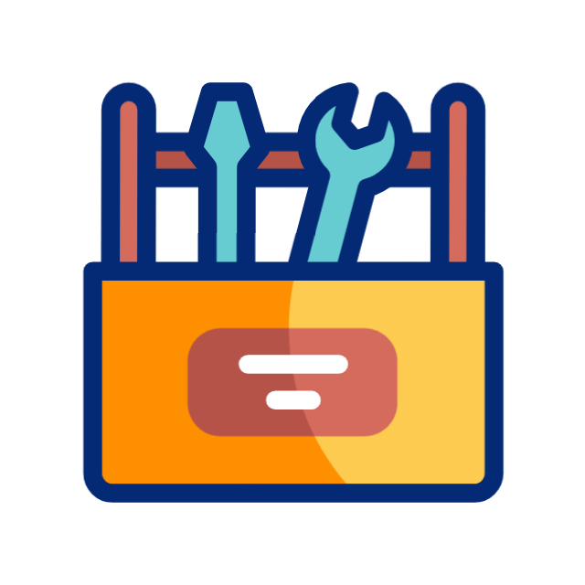

<h2 align="center">👋 Hola, soy <strong>Domingo</strong></h2>

💻 Desarrollador de Software | Construyendo futuro con cada línea de código

  
   
  ⚠️ MASTER START — PULSADOR PRINCIPAL

---

##  Stack Tecnológico

###  Backend

  
  
  
  
  

---

###  Base de Datos

  
  
  
  

---

###  Frontend

  
  
  
  
  
  

---

###  Tools del desarrollador

  <!-- CONTROL DE VERSIONES -->
  
  
  
  
  

  <!-- ENTORNO / SO -->
  
  
  

  <!-- IDE / EDITORES -->
  
  
  

  <!-- APIs / DISEÑO -->
  
  

  <!-- DEVOPS -->
  
  

---

##  Estadísticas

  

  <!--  -->

  

---

##  Cómo trabajo

  
  
  
  
  

---

###  Mis valores como desarrollador
- Aprender rápido  
- Ser constante  
- Trabajar con detalle  
- Buscar calidad aunque esté empezando  
- Poner cariño en cada proyecto

---

##  Contacto

  

  

---
