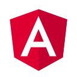
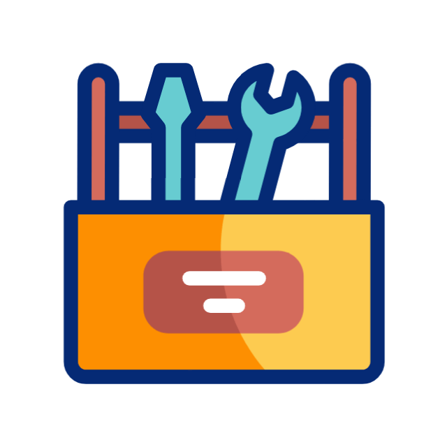
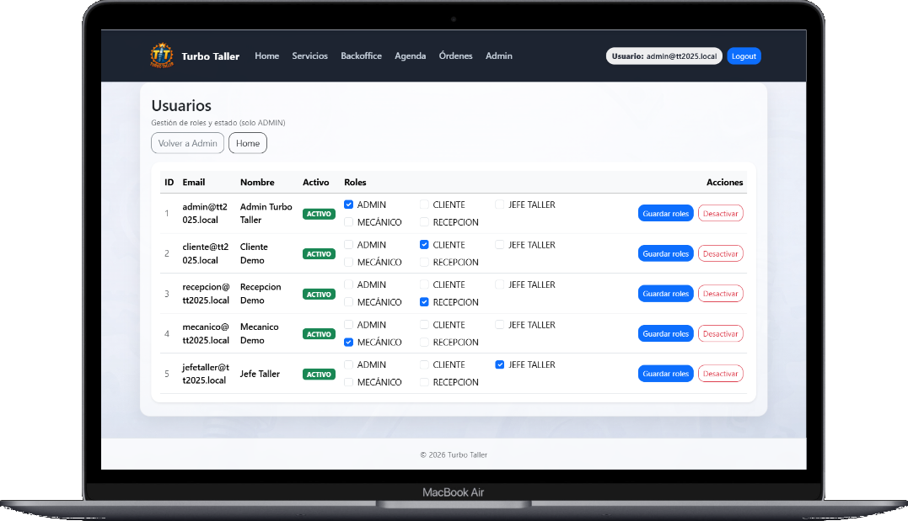
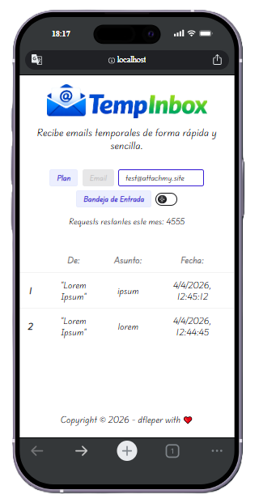
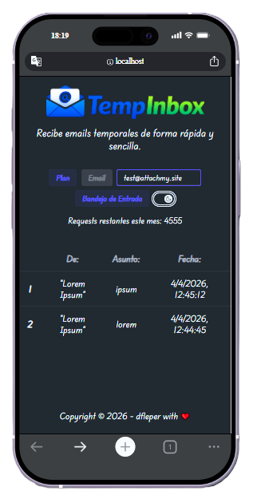
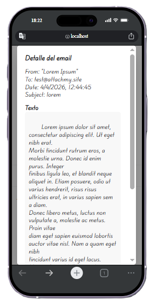

<h2 align="center">👋 Hola, soy <strong>Domingo</strong></h2>

💻 Desarrollador de Software

Busco mejorar en cada proyecto, cuidar los detalles y construir soluciones funcionales y bien ordenadas.

  
   
  ⚠️ MASTER START — CTRL + CLICK

---

##  Stack Tecnológico

###  Backend

  
  
  
  
  
  

---

###  Base de Datos

  
  
  
  
  
  

---

###  Frontend

  
  
  
  
  
  

---

###  Herramientas del desarrollador

#### Control de Versiones y Organización

  
  
  
  
  

#### Entorno

  
  

#### Editores

  
  
  

#### Diseño

  
  
  
  

#### DevOps

  
  

#### API

  

#### Navegadores / Testing

  

#### Deploy / Transferencia

  

---

###  Otros conocimientos

  

---

##  Estadísticas

  
  <!--  -->

  

  

---

##  Cómo trabajo

  
  
  
  
  

---

###  Mis valores como desarrollador
- Aprendizaje constante  
- Atención al detalle
- Constancia en cada proyecto
- Ganas de mejorar continuamente 
- Compromiso con la calidad del trabajo

---

##  Proyectos destacados

<table>
  <tr>
    <td width="50%" valign="top">
      <h3>TT2025</h3>
      

        
      

       
      <small>
      
Aplicación web para gestionar citas de un taller de mecánica rápida. Incluye gestión de clientes/vehículos, historial de servicios y notificaciones.

       
      
<strong>Tecnologías:</strong> HTML5, CSS3, JavaScript, Spring Boot, Thymeleaf, MariaDB.

      

        <strong>Repositorio:</strong>
        <a href="https://github.com/dfleper/PRW-TT2025"><strong>Ver en GitHub</strong></a> 

      
<strong>Demo:</strong>
        <a href="https://prw-tt2025-production.up.railway.app/"><strong>Ver proyecto</strong></a>
      

      </small>
    </td>
    <td width="50%" valign="top">
      <h3>TempInbox</h3>
      

        
      

       
      <small>
      
TempInbox es un buzón temporal hecho con HTML, CSS y JavaScript que usa FreeCustom Email para recibir correos desechables.

       
      
<strong>Tecnologías:</strong> HTML5, CSS3, Vanilla JavaScript, Node.

      

        <strong>Repositorio:</strong>
        <a href="https://github.com/dfleper/TempInbox"><strong>Ver en GitHub</strong></a> 

      
<strong>Demo:</strong>
        <a href="https://tempinbox-frontend-production.up.railway.app/"><strong>Ver proyecto</strong></a>
      

      </small>
    </td>
  </tr>
</table>

---

##  Contacto

  

  

---